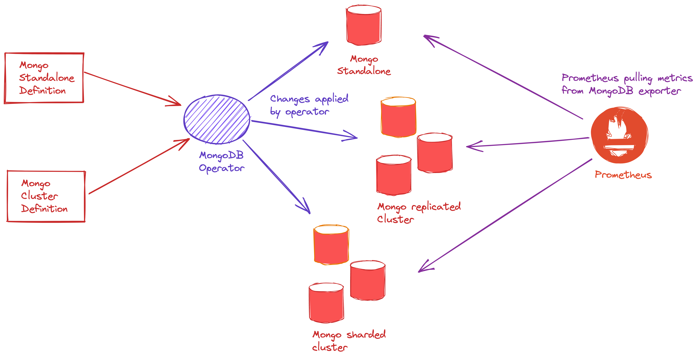

  

MongoDB Operator is an operator created in Golang to create, update, and manage MongoDB standalone, replicated, and arbiter replicated setup on Kubernetes and Openshift clusters. This operator is capable of doing the setup for MongoDB with all the required best practices.

For documentation, please refer to https://ot-container-kit.github.io/mongodb-operator/

## Architecture

Architecture for MongoDB operator looks like this:-

    

## Purpose 

The aim and purpose of creating this MongoDB operator are to provide an easy and extensible way of deploying a Production grade MongoDB setup on Kubernetes. It helps in designing the different types of MongoDB setup like - standalone, replicated, etc with security and monitoring best practices.

## Supported Features

- MongoDB standalone setup
- Monitoring support with MongoDB Exporter
- Password based authentication for MongoDB

## Upcoming Features

- MongoDB cluster setup
- MongoDB cluster setup with arbiter
- Customizable configuration changes in MongoDB
- TLS security support
- Backup and restore support
- DB and user creation 
- Insightful Grafana dashboards

